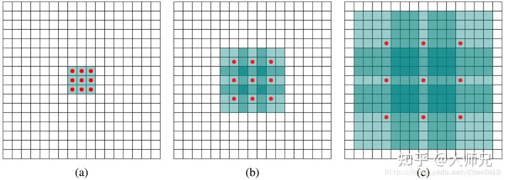
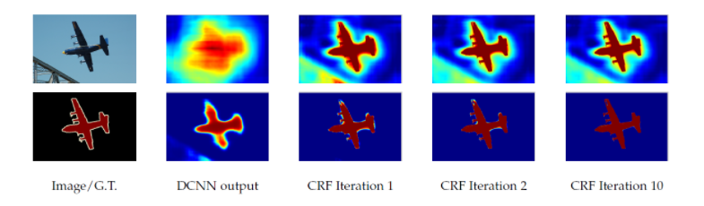
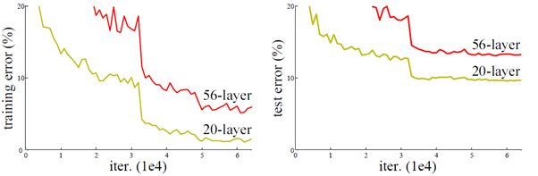
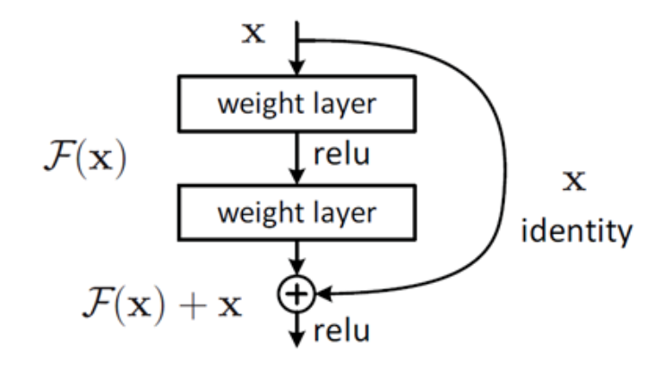
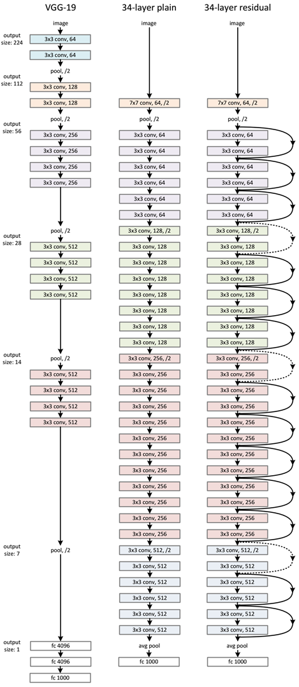
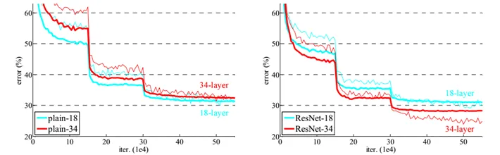
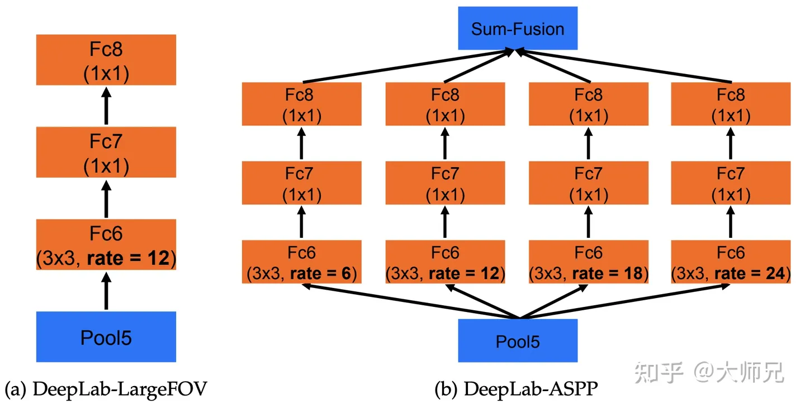
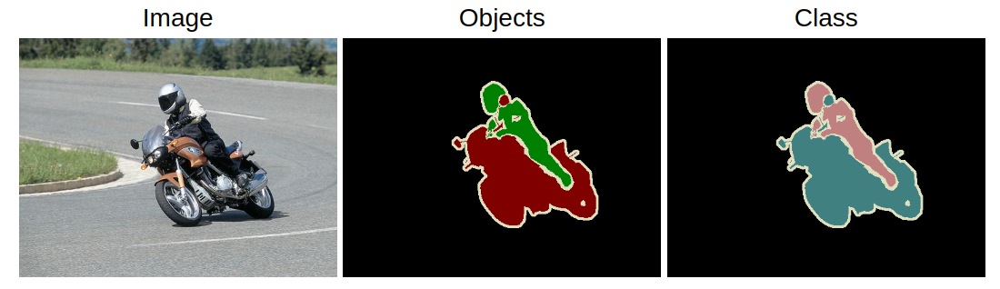
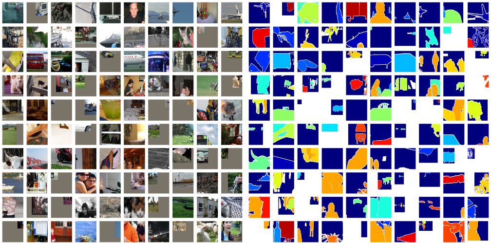
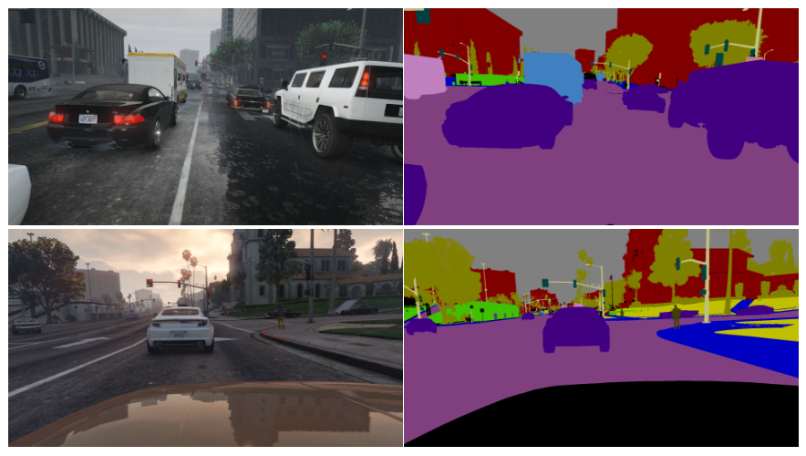

# Semantic Segmentation based on DeepLab-v2 with a ResNet-101 backbone

## 1. Introduction

Semantic segmentation is a computer vision task that aims to assign semantic labels to each pixel in an image, effectively dividing the image into different regions corresponding to different objects or classes. The goal is to achieve a fine-grained understanding of the image by assigning meaningful labels to different regions, such as "person," "car," "building," etc.

The main challenge in semantic segmentation is accurately delineating the boundaries of objects and accurately labeling each pixel within those boundaries. This task is more complex than simple object detection or classification because it requires capturing both the global context and the local details of the image.

Overcoming these challenges requires the development of advanced algorithms and architectures, as well as the availability of large-scale annotated datasets for training. Recent advancements in deep learning, especially convolutional neural networks and encoder-decoder architectures, have significantly improved the performance of semantic segmentation systems. However, ongoing research efforts are focused on addressing the remaining challenges to further advance the state-of-the-art in semantic segmentation.

## 2. Related works

Semantic segmentation has been an active area of research in computer vision, and several notable approaches have been proposed to address the challenges of accurate pixel-level labeling. Here are some related works in the field of semantic segmentation:

1. **Fully Convolutional Networks (FCN)**: FCN is the first work of semantic segmentation. It introduced the concept of end-to-end training for semantic segmentation using fully convolutional neural networks. It replaced the fully connected layers of traditional CNN architectures with convolutional layers to preserve spatial information. FCN achieved state-of-the-art performance by predicting dense pixel-wise class labels.
2. **U-Net**: U-net is used to solve simple problem segmentation of small samples. It follows the same basic principles as FCN. U-Net is an encoder-decoder architecture designed for biomedical image segmentation. It includes skip connections between the encoder and decoder, enabling the model to capture both high-level semantic information and fine-grained details. U-Net has been widely adopted and extended for various segmentation tasks.
3. **DeepLab**: DeepLab introduced dilated convolutions to capture multi-scale contextual information. It employs atrous spatial pyramid pooling (ASPP) to aggregate information at different scales and uses a fully connected conditional random field (CRF) for refining the segmentation results.

## 3. Method
For our project, DeepLab-v2 model with a ResNet-101 backbone is selected for semantic segmentation. And in this section, the advantages of Deeplab and corresponding improvements of Deeplab-v2 will be explained in detail.

### 3.1 Advantages of DeepLab

DeepLab model is proposed to handle three major problems of image segmentation using DCNN, which reflects three different features from previous ideas:
- Due to the reduction of feature resolution, Atrous convolution with a higher sample rate is applied to substitude the last maxpooling of DCNN. Meanwhilehe feature map is restored to the original size by combining void convolution and bilinear interpolation. The sample figure is shown below.

- Due to the targets of various sizes, the feature map is convolved at multiple rates to enhance the receptive field.
- Due to the invariance of DCNN, the segmentation boundary is imprecise. Therefore CRF(Conditional Random Field) is invoked to take advantage of the correlation information between pixels: adjacent pixels, or pixels with similar colors, are more likely to belong to the same class. The improvement of CRF can be shown in the figure below.

### 3.2 Improvements of DeepLab-v2

**ResNet-101**: In DeepLab-v1, VGG16 acted as backbone, which has limited performance as the network grows deeper, or in other words, Degradation problem$^{[4]}$. This common problem generally means when the depth of the network increases, the accuracy of the network becomes saturated or even decreases, as the figure shown below. 

Therefore, Residual Learning is invoked to solve the problem. Briefly speaking, the reason for Residual Learning is that learning residuals is easier than learning raw features directly. When the residual is 0, then the stack layer only does the identity mapping, at least the network performance will not deteriorate, in fact, the residual will not be 0, which will also make the stack layer learn new features based on the input features, so as to have better performance. Residual Learning uses a kind of trick called "short-circuit", as the figure shown below$^{[4]}$.

The ResNet network is a reference to the VGG19 network, modified on its basis, and adds Residual Learning units through the short-circuit mechanism to increase the possible depth of network, as the figure shown below.

We can compare the preformance of ResNet to common network, as the figure shown below. It can be seen that the common network is degraded as the depth increases, while ResNet solves the degradation problem well.

**ASPP**: Also, Deeplab v2 improves on v1 with the introduction of ASPP(Atrous Spatial Pyramid Pooling). We noticed that Deeplab v1 did not fuse information between different layers after expanding the receptive field using porous convolution. ASPP layer is designed to fuse different levels of semantic information: porous convolution with different expansion rates is selected to process feature maps$^{[1]}$. Due to different receptive fields, the information levels obtained are also different. ASPP layer concat these different levels of feature maps to carry out information fusion.

Specifically, in our project, ASPP-L with expansion rate {6, 12, 18, 24} is applied, and two more 1 * 1 convolution performs feature fusion after Atrous convolution, and finally obtains the final output result by adding units$^{[1]}$. The structure is described as the figure shown below.

## 4. Experiments

### 4.1 Datasets 

#### 4.1.1 PASCAL VOC 2012

The [PASCAL VOC 2012 dataset](http://host.robots.ox.ac.uk/pascal/VOC/voc2012/) is a benchmark dataset widely used in computer vision for semantic segmentation tasks. It consists of around 11,530 images, each annotated with pixel-level segmentation masks. The dataset covers 20 + 1(background) common object categories and provides a standardized evaluation protocol for measuring algorithm performance$^{[3]}$. Pascal VOC 2012 has played a significant role in advancing semantic segmentation research and model development.

#### 4.1.2 COCO-Stuff

The [**Common Objects in COntext-stuff** (COCO-stuff) dataset](https://github.com/nightrome/cocostuff#downloads) is a dataset for scene understanding tasks like semantic segmentation, object detection and image captioning. It is constructed by annotating the original COCO dataset, which originally annotated things while neglecting stuff annotations. There are 164k images in COCO-stuff dataset that span over 172 categories including 80 things, 91 stuff, and 1 unlabeled class$^{[2]}$.

#### 4.1.3 GTA5 Dataset

The GTA5 dataset contains 24966 synthetic images with pixel level semantic annotation. The images have been rendered using the open-world video game *Grand Theft Auto 5* and are all from the car perspective in the streets of American-style virtual cities. There are 19 semantic classes.

#### 4.1.4 Self-labeled Pictures

### 4.2 Implementation

#### 4.2.1 Data Preprocessing

#### 4.2.2 Model Training

### 4.3 Metrics 

Four major metrics are adopted for our model evaluation: **PA, MPA, MIoU, FWIoU**. Ahead of them, true positive(TP), true negative(TN), false positive(FP) and false negative(FN) are represented as $p_{ii}$, $p_{ij}$, $p_{ji}$, $p_{jj}$ for calculation.

**PA(Pixle Accuracy)** calculates the ratio of correct-classified pixels, and is the simplest metric.
$$
PA = \frac{\sum^k_{i = 0}p_{ii}}{\sum^k_{i=0}\sum^k_{j=0}p_{ij}} 
$$

**MPA(Mean Pixle Accuracy)** is a improvement of PA, which calculates the ratio of correct-classified pixels for each class and then calculates the average accuracy of all classes.
$$
MPA = \frac{1}{k+1} \sum^k_{i = 0}\frac{p_{ii}}{\sum^k_{j=0}p_{ij}}
$$

**MIoU(Mean Intersection over Union)** is a standard metric for semantic segmentation, which calculates intersection of the ground truth and prediction over union of them for each class. Then, a mean value is calculated for evaluation.
$$
MIoU = \frac{1}{k+1} \sum^k_{i = 0}\frac{p_{ii}}{\sum^k_{j=0}p_{ij} + \sum^k_{j=0}p_{ji}-p_{ii}}
$$

**FWIoU(Frequency Weighted Intersection over Union)** is a improvement of MIoU, which sets the weights of each class based on frequency of their appearance.
$$
FWIoU = \frac{1}{\sum^k_{i=0}\sum^k_{j=0}p_{ij}} \sum^k_{i = 0}\frac{p_{ii}}{\sum^k_{j=0}p_{ij} + \sum^k_{j=0}p_{ji}-p_{ii}}
$$

All the four metrics listed above are considered and calculated for our model, and corresponding results will be shown in following subsection.

### 4.4 Experimental Design & Results

#### 4.4.1 Experiment Design

4.4.2 Result Analysis

## 5. Conclusion
Our model can be easily applied for image segmentation and pixel classification. However, video type input seems tricky for us to apply DeepLab-v2 model. To handle that, we modified the demo code of model to achieve by-frame analysis for each decomposed picture, and convert the frames with segmentation result into a new mp4 file. The results are shown above at experiment section, which is satisfying and of comparatively high accuracy. Moreover, after several experiments, we found that as the expansion rate of void convolution increases, the effective weights in the convolution kernel become less and less, which leads to the loss of global image information. We have searched for sulutions and found that ASPP can be improved by adding a branch to improve the global view of the image, which includes BN and bilinear interpolation upsampling. These problems affect our model's performance to some extent, but can be solved after application of our improvements.

### Reference

[1] L.-C. Chen, G. Papandreou, I. Kokkinos, K. Murphy, A. L. Yuille. DeepLab: Semantic Image Segmentation with Deep Convolutional Nets, Atrous Convolution, and Fully Connected CRFs. *IEEE TPAMI*, 2018.

[2] H. Caesar, J. Uijlings, V. Ferrari. COCO-Stuff: Thing and Stuff Classes in Context. In *CVPR*, 2018.

[3] M. Everingham, L. Van Gool, C. K. I. Williams, J. Winn, A. Zisserman. The PASCAL Visual Object Classes (VOC) Challenge. *IJCV*, 2010.

[4] He, K. ,  Zhang, X. ,  Ren, S. , &  Sun, J. . (2016). Deep residual learning for image recognition. IEEE.

[5] He, Kaiming, et al. "Spatial pyramid pooling in deep convolutional networks for visual recognition." IEEE transactions on pattern analysis and machine intelligence 37.9 (2015): 1904-1916.

### Contributions

Yuhang Wang (12012208): 

Jianlin Li (12012221): 

Zhangjie Chen (12012524):

