# CS308 Final Project Report

## Semantic Segmentation based on DeepLab-v2 with a ResNet-101 backbone

Yuhang Wang (12012208)

Jianlin Li (12012221)

Zhangjie Chen (12012524)

## 1. Introduction

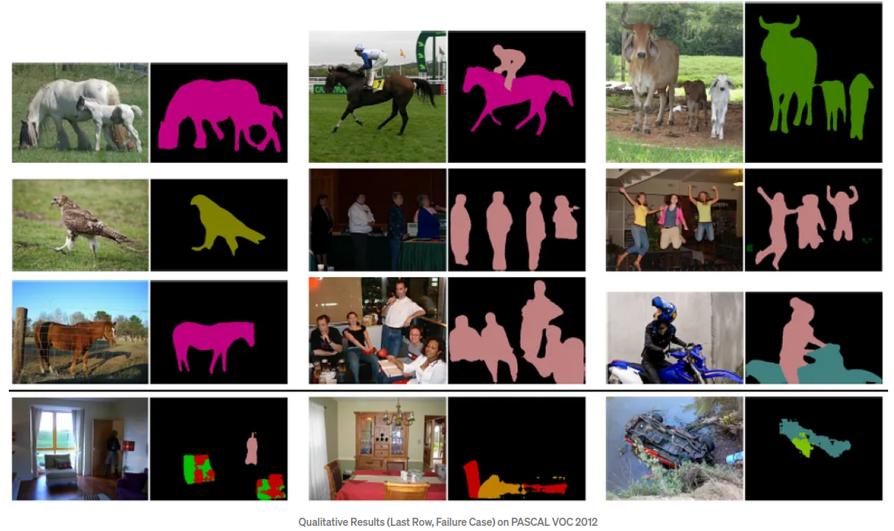

Semantic segmentation is a computer vision task that aims to assign semantic labels to each pixel in an image, effectively dividing the image into different regions corresponding to different objects or classes. The goal is to achieve a fine-grained understanding of the image by assigning meaningful labels to different regions, such as "person," "car," "building," etc.

The main challenge in semantic segmentation is accurately delineating the boundaries of objects and accurately labeling each pixel within those boundaries. This task is more complex than simple object detection or classification because it requires capturing both the global context and the local details of the image.

Overcoming these challenges requires the development of advanced algorithms and architectures, as well as the availability of large-scale annotated datasets for training. Recent advancements in deep learning, especially convolutional neural networks and encoder-decoder architectures, have significantly improved the performance of semantic segmentation systems. However, ongoing research efforts are focused on addressing the remaining challenges to further advance the state-of-the-art in semantic segmentation.

## 2. Related works

Semantic segmentation has been an active area of research in computer vision, and several notable approaches have been proposed to address the challenges of accurate pixel-level labeling. Here are some related works in the field of semantic segmentation:

1. **Fully Convolutional Networks (FCN)**: FCN is the first work of semantic segmentation. It introduced the concept of end-to-end training for semantic segmentation using fully convolutional neural networks. It replaced the fully connected layers of traditional CNN architectures with convolutional layers to preserve spatial information. FCN achieved state-of-the-art performance by predicting dense pixel-wise class labels.
2. **U-Net**: U-net is used to solve simple problem segmentation of small samples. It follows the same basic principles as FCN. U-Net is an encoder-decoder architecture designed for biomedical image segmentation. It includes skip connections between the encoder and decoder, enabling the model to capture both high-level semantic information and fine-grained details. U-Net has been widely adopted and extended for various segmentation tasks.
3. **DeepLab**: DeepLab introduced dilated convolutions to capture multi-scale contextual information. It employs atrous spatial pyramid pooling (ASPP) to aggregate information at different scales and uses a fully connected conditional random field (CRF) for refining the segmentation results.

## 3. Method

For our project, DeepLab-v2 model with a ResNet-101 backbone is selected for semantic segmentation. And in this section, the advantages of DeepLab and corresponding improvements of DeepLab-v2 will be explained in detail.

### 3.1 Advantages of DeepLab

DeepLab model is proposed to handle three major problems of image segmentation using DCNN, which reflects three different features from previous ideas:
- Due to the reduction of feature resolution, Atrous convolution with a higher sample rate is applied to substitude the last maxpooling of DCNN. Meanwhile the feature map is restored to the original size by combining void convolution and bilinear interpolation. The sample figure is shown below.

- Due to the targets of various sizes, the feature map is convolved at multiple rates to enhance the receptive field.
- Due to the invariance of DCNN, the segmentation boundary is imprecise. Therefore CRF(Conditional Random Field) is invoked to take advantage of the correlation information between pixels: adjacent pixels, or pixels with similar colors, are more likely to belong to the same class. The improvement of CRF can be shown in the figure below.

### 3.2 Improvements of DeepLab-v2

**ResNet-101**: In DeepLab-v1, VGG16 acted as backbone, which has limited performance as the network grows deeper, or in other words, Degradation problem$^{[4]}$. This common problem generally means when the depth of the network increases, the accuracy of the network becomes saturated or even decreases, as the figure shown below. 

Therefore, Residual Learning is invoked to solve the problem. Briefly speaking, the reason for Residual Learning is that learning residuals is easier than learning raw features directly. When the residual is 0, then the stack layer only does the identity mapping, at least the network performance will not deteriorate, in fact, the residual will not be 0, which will also make the stack layer learn new features based on the input features, so as to have better performance. Residual Learning uses a kind of trick called "short-circuit", as the figure shown below$^{[4]}$.

The ResNet network is a reference to the VGG19 network, modified on its basis, and adds Residual Learning units through the short-circuit mechanism to increase the possible depth of network, as the figure shown below.

We can compare the performance of ResNet to common network, as the figure shown below. It can be seen that the common network is degraded as the depth increases, while ResNet solves the degradation problem well.

**ASPP**: Also, DeepLab v2 improves on v1 with the introduction of ASPP(Atrous Spatial Pyramid Pooling). We noticed that DeepLab v1 did not fuse information between different layers after expanding the receptive field using porous convolution. ASPP layer is designed to fuse different levels of semantic information: porous convolution with different expansion rates is selected to process feature maps$^{[1]}$. Due to different receptive fields, the information levels obtained are also different. ASPP layer concat these different levels of feature maps to carry out information fusion.

Specifically, in our project, ASPP-L with expansion rate {6, 12, 18, 24} is applied, and two more 1 * 1 convolution performs feature fusion after Atrous convolution, and finally obtains the final output result by adding units. The structure is described as the figure shown below.

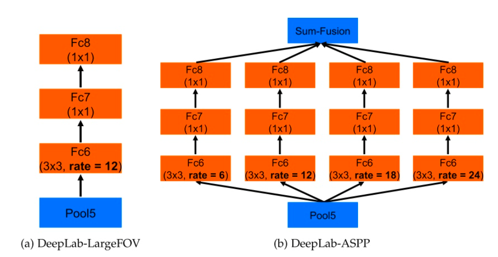

## 4. Experiments

### 4.1 Datasets 

#### 4.1.1 PASCAL VOC 2012

The [PASCAL VOC 2012 dataset](http://host.robots.ox.ac.uk/pascal/VOC/voc2012/) is a benchmark dataset widely used in computer vision for semantic segmentation tasks. It consists of around 11,530 images, each annotated with pixel-level segmentation masks. The dataset covers 20 + 1(background) common object categories and provides a standardized evaluation protocol for measuring algorithm performance$^{[3]}$. Pascal VOC 2012 has played a significant role in advancing semantic segmentation research and model development.

#### 4.1.2 COCO-Stuff

The [**Common Objects in COntext-stuff** (COCO-stuff) dataset](https://github.com/nightrome/cocostuff#downloads) is a dataset for scene understanding tasks like semantic segmentation, object detection and image captioning. It is constructed by annotating the original COCO dataset, which originally annotated things while neglecting stuff annotations. There are 164k images in COCO-stuff dataset that span over 172 categories including 80 things, 91 stuff, and 1 unlabeled class$^{[2]}$.

#### 4.1.3 Self-labeled Pictures

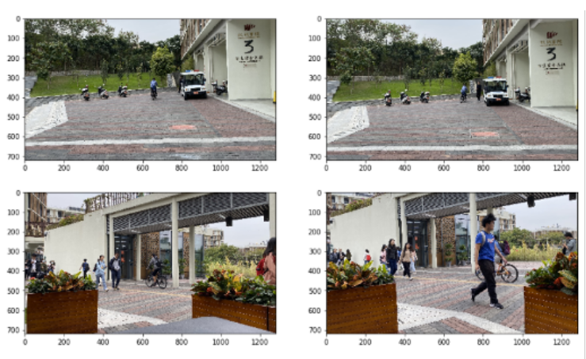

Besides the above two datasets, we also manually collected pictures from Sustech campus and labeled each of them with a graphical image annotation tool [**labelme**](https://github.com/wkentaro/labelme). These pictures will be used as a test set for model evaluation due to limited number.

### 4.2 Implementation

#### 4.2.1 Data Preprocessing

Dataset Augmentation is a very common trick in computer vision to make the best use of the limited dataset. 

In our experiment, the input images are randomly re-scaled by factors ranging from 0.5 to 1.5, and randomly cropped to 321x321.

#### 4.2.2 Model Training

In our implementation, we trained our models based on the PASCAL VOC 2012 dataset and the COCO-Stuff dataset respectively, with the following parameters:

| Dataset       | Number of Class | Scales                    | Iteration | Batch Size | Momentum | Learning Rate |
| ------------- | --------------- | ------------------------- | --------- | ---------- | -------- | ------------- |
| cocostuff-10k | 182             | 0.5, 0.75, 1.0, 1.25, 1.5 | 20,000    | 5          | 0.9      | 2.5e-4        |
| PASCAL VOC 12 | 21              | 0.5, 0.75, 1.0, 1.25, 1.5 | 20,000    | 5          | 0.9      | 2.5e-4        |

During the training process, we followed a two-step process. First, we initialized the weights of the Deeplab v2 model with the pretrained ResNet101 model weights. This allowed the model to benefit from the feature extraction capabilities of ResNet101, which had been trained on a large-scale image classification dataset (ImageNet). Then, we fine-tuned the model using the PASCAL VOC 2012 and COCO-Stuff datasets.

The batch size was set to 5 for both datasets. This means that during each training iteration, the model processed a batch of 5 images. A larger batch size can potentially lead to better GPU utilization and faster convergence, but it requires more GPU memory. We chose a batch size of 5 based on the available computational resources and the model's memory requirements.

We trained both models for a total of 20,000 iterations for each dataset. This number of iterations was determined through experimentation and balancing the trade-off between model performance and training time. It allowed the models to converge to a reasonably good performance while avoiding overfitting.

We utilized a loss function to guide the model's learning. The commonly used Cross-Entropy Loss was employed, which calculates the discrepancy between the predicted class probabilities and the ground truth labels. The loss was minimized using backpropagation and stochastic gradient descent optimization.

### 4.3 Metrics 

Four major metrics are adopted for our model evaluation: **PA, MA, MIoU, FWIoU**. Ahead of them, true positive(TP), true negative(TN), false positive(FP) and false negative(FN) are represented as $p_{ii}$, $p_{ij}$, $p_{ji}$, $p_{jj}$ for calculation.

**PA(Pixle Accuracy)** measures the percentage of correctly classified pixels compared to the total number of pixels in the evaluation dataset. It provides an overall measure of how accurately the model predicts the class labels for individual pixels. However, PA does not consider the class imbalance in the dataset and may not provide a comprehensive understanding of the model's performance.
$$
PA = \frac{\sum^k_{i = 0}p_{ii}}{\sum^k_{i=0}\sum^k_{j=0}p_{ij}}
$$

**MA(Mean Accuracy)** is the average of class-wise accuracies, where class-wise accuracy is the ratio of correctly classified pixels for each class to the total number of pixels belonging to that class. MA provides a measure of the average accuracy across different classes, taking into account the class imbalance. It can be more informative than PA when dealing with imbalanced datasets.
$$
MA = \frac{1}{k+1} \sum^k_{i = 0}\frac{p_{ii}}{\sum^k_{j=0}p_{ij}}
$$

**MIoU(Mean Intersection over Union)** is a widely used evaluation metric for semantic segmentation. It calculates the Intersection over Union (IoU) for each class and then takes the average across all classes. IoU is calculated as the ratio of the intersection area between the predicted and ground truth segmentation masks to the union area. mIoU provides a measure of the overall segmentation accuracy, accounting for both class-wise accuracy and the ability to capture the spatial extent of objects.
$$
MIoU = \frac{1}{k+1} \sum^k_{i = 0}\frac{p_{ii}}{\sum^k_{j=0}p_{ij} + \sum^k_{j=0}p_{ji}-p_{ii}}
$$

**FWIoU(Frequency Weighted Intersection over Union)** is a variant of IoU that takes into account the frequency or proportion of each class in the evaluation dataset. It calculates the weighted average of IoU values, where the weights are determined by the frequency of each class. FWIoU provides a measure of overall segmentation accuracy while considering the class imbalance. It can be particularly useful when evaluating models on datasets with imbalanced class distributions.
$$
FWIoU = \frac{1}{\sum^k_{i=0}\sum^k_{j=0}p_{ij}} \sum^k_{i = 0}\frac{p_{ii}}{\sum^k_{j=0}p_{ij} + \sum^k_{j=0}p_{ji}-p_{ii}}
$$

All the four metrics listed above are considered and calculated for our model, and corresponding results will be shown in following subsection.

### 4.4 Experimental Design & Results

#### 4.4.1 Experiment Design

For the models, we chose the PASCAL VOC 2012 and COCO-Stuff datasets as our target datasets for evaluation. To ensure unbiased evaluation, we have split each target dataset into training and validation subsets. The training subset was used for training the models, while the validation subset was reserved solely for evaluating their performance. The validation subset was carefully selected to be representative of the overall dataset, containing a balanced distribution of object categories and environmental conditions.

We utilized standard evaluation metrics to assess the performance of the models. The primary metric used was mean Intersection over Union (mIoU), which measures the overlap between the predicted segmentation masks and the ground truth masks for each class and calculates the average across all classes. Additionally, we calculated pixel accuracy, which measures the percentage of correctly classified pixels compared to the total number of pixels in the validation dataset.

We also tested both models on other datasets such as self-sampled Sustech pictures to evaluate the performance.

We applied test based on following parameters:

| Model       | Test Set                     | Input Size | Batch Size |
| ----------- | ---------------------------- | ---------- | ---------- |
| coco10k.pth | cocostuff-10k-v1.1           | 513x513    | 5          |
| coco10k.pth | self-sampled Sustech dataset | 513x513    | 1          |
| voc12.pth   | VOCdevkit                    | 513x513    | 1          |
| voc12.pth   | self-sampled Sustech dataset | 513x513    | 1          |

#### 4.4.2 Result

We have done several experiments to show the performance of the models and the results are given in the following table.

#### voc12.pth

| Target Domain                | PA    | MA    | MIoU  | FWIoU |
| ---------------------------- | ----- | ----- | ----- | ----- |
| VOC2012 test set             | 97.91 | 93.46 | 89.87 | 95.98 |
| self-sampled Sustech pic set | 81.75 | 76.88 | 69.15 | 82.09 |

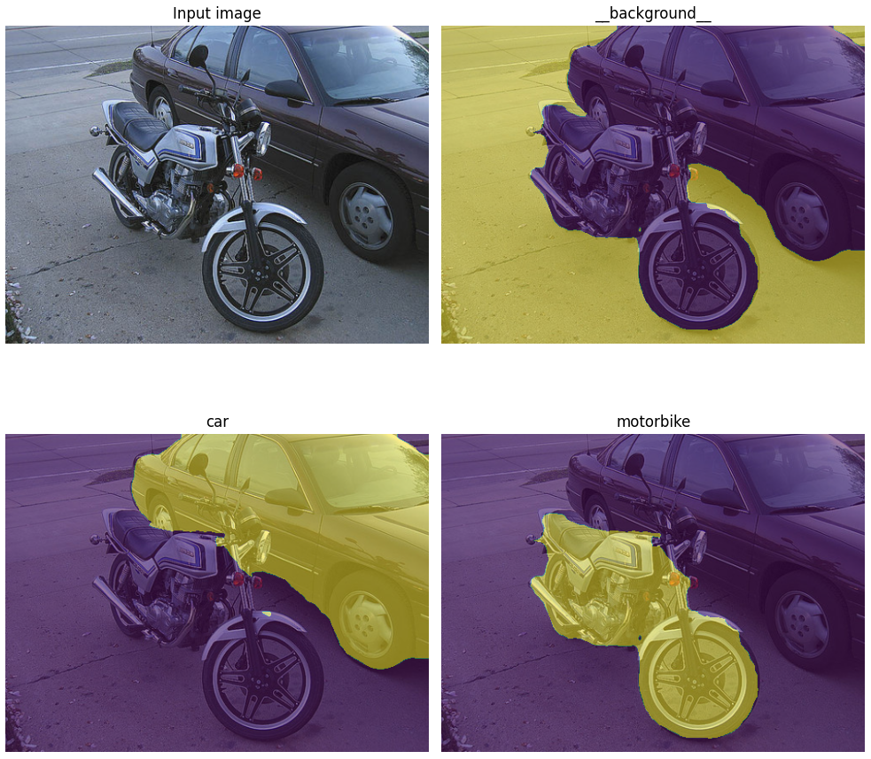

*voc12.pth performance on VOC dataset*

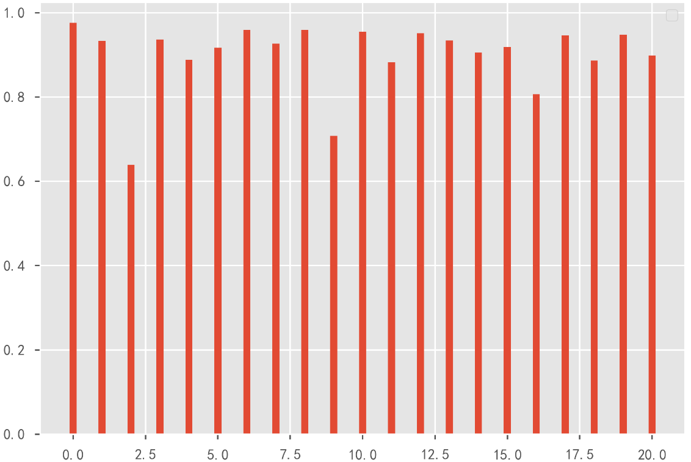

*voc12.pth on VOC dataset: IoU of each semantic class*

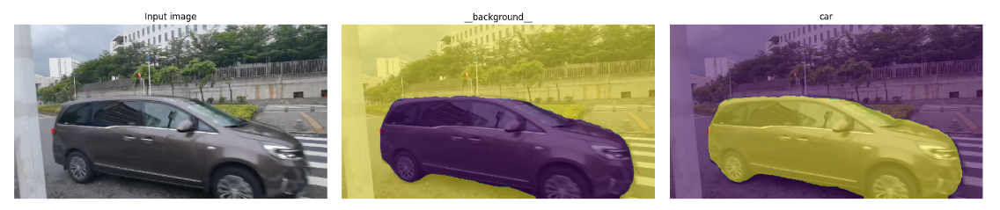

*voc12.pth performance on Sustech dataset*

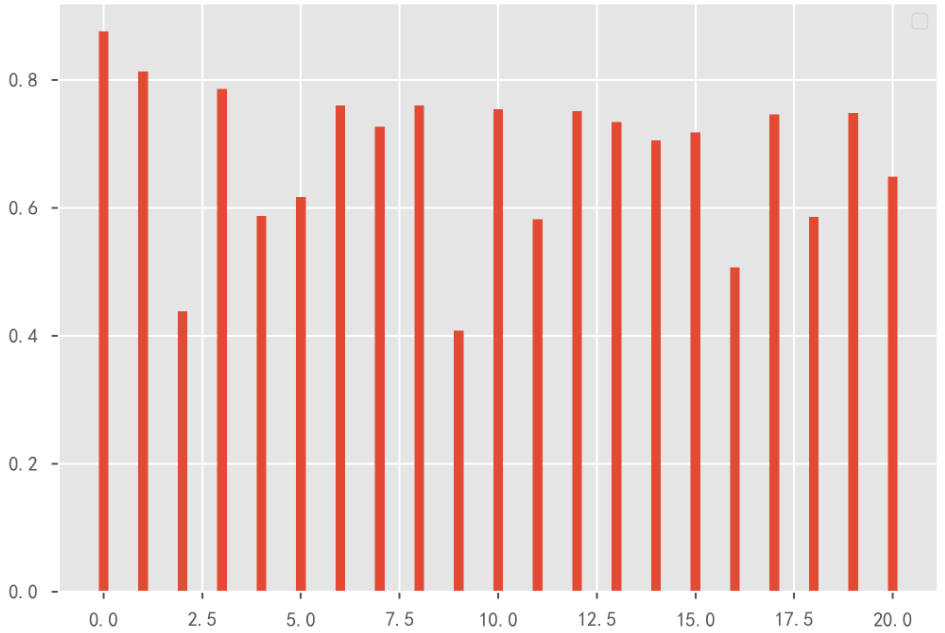

*voc12.pth on Sustech dataset: IoU of each semantic class*

#### coco10k.pth

| Target Domain                | PA    | MA    | MIoU  | FWIoU |
| ---------------------------- | ----- | ----- | ----- | ----- |
| cocostuff-10k-v1.1 test set  | 65.83 | 45.66 | 34.81 | 51.26 |
| self-sampled Sustech pic set | 50.75 | 31.43 | 22.74 | 36.83 |

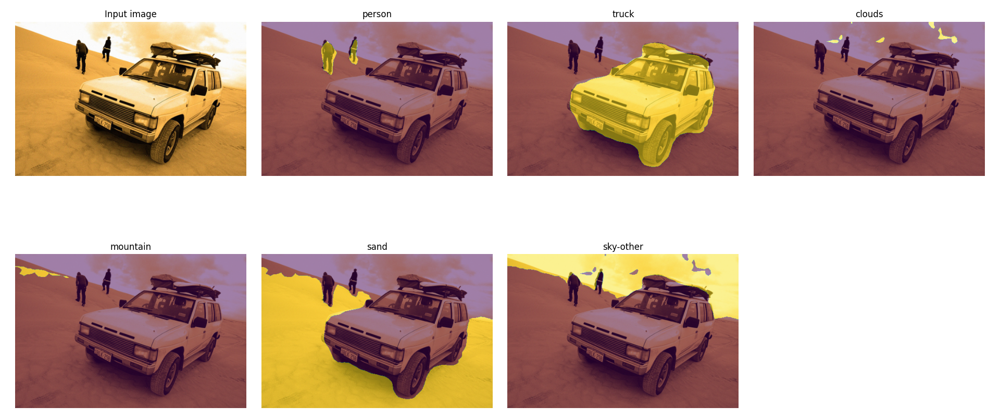

*coco10k.pth performance on cocostuff-10k dataset*

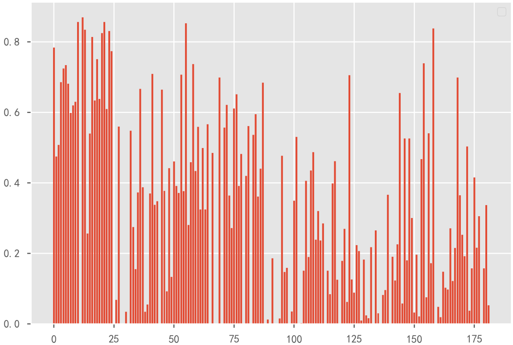

*coco10k.pth on coco10k dataset: IoU of each semantic class*

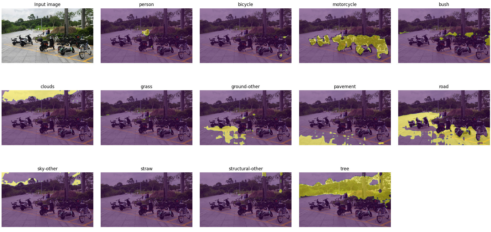

*coco10k.pth performance on Sustech dataset*

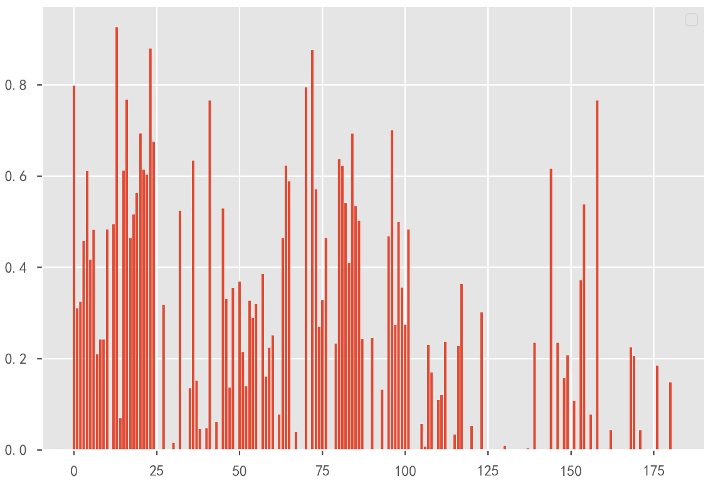

*coco10k.pth on Sustech dataset: IoU of each semantic class*

#### 4.4.3 Segmenting videos/Running on webcams

The models can also be applied to each frames of a video input or webcam input. Then a segmented video can be generated based on all segmented frames. 

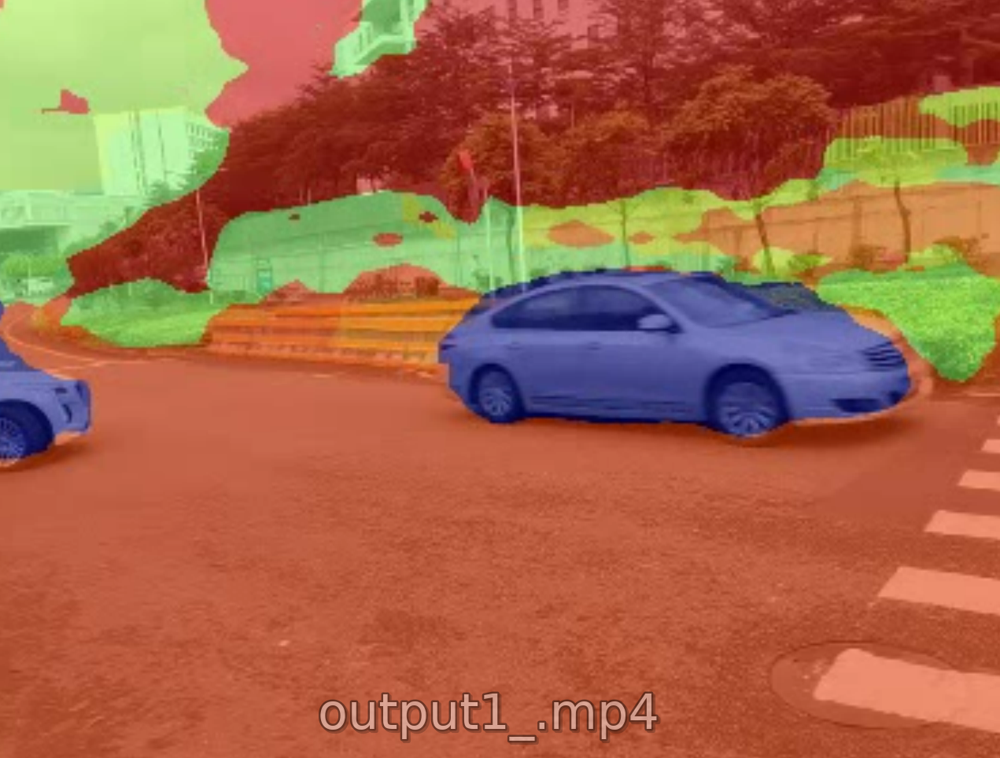

## 5. Conclusion
Our model can be easily applied for image segmentation and pixel classification. However, video type input seems tricky for us to apply DeepLab-v2 model. To handle that, we modified the demo code of model to achieve by-frame analysis for each decomposed picture, and convert the frames with segmentation result into a new mp4 file. The results are shown above at experiment section, which is satisfying and of comparatively high accuracy. Moreover, after several experiments, we found that as the expansion rate of void convolution increases, the effective weights in the convolution kernel become less and less, which leads to the loss of global image information. We have searched for solutions and found that ASPP can be improved by adding a branch to improve the global view of the image, which includes BN and bilinear interpolation upsampling. These problems affect our model's performance to some extent, but can be solved after application of our improvements.

## Reference

[1] L.-C. Chen, G. Papandreou, I. Kokkinos, K. Murphy, A. L. Yuille. DeepLab: Semantic Image Segmentation with Deep Convolutional Nets, Atrous Convolution, and Fully Connected CRFs. *IEEE TPAMI*, 2018.

[2] H. Caesar, J. Uijlings, V. Ferrari. COCO-Stuff: Thing and Stuff Classes in Context. In *CVPR*, 2018.

[3] M. Everingham, L. Van Gool, C. K. I. Williams, J. Winn, A. Zisserman. The PASCAL Visual Object Classes (VOC) Challenge. *IJCV*, 2010.

[4] He, K. ,  Zhang, X. ,  Ren, S. , &  Sun, J. . (2016). Deep residual learning for image recognition. IEEE.

[5] He, Kaiming, et al. "Spatial pyramid pooling in deep convolutional networks for visual recognition." IEEE transactions on pattern analysis and machine intelligence 37.9 (2015): 1904-1916.

## Contributions

* Yuhang Wang (12012208): 30%

* Jianlin Li (12012221): 35%

* Zhangjie Chen (12012524): 35%

Github repo: https://github.com/starga2er777/Sustech_CS308_Final_Project

